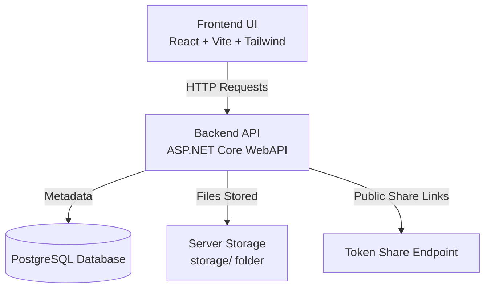

# PeakDrive 🚀


**PeakDrive** is a private team drive system built with **.NET 8 WebAPI** and **React (Vite)**.

It is designed for internal organizations where accounts are created only by administrators (no public registration).

- Files are stored directly on server-side storage  
- Metadata and permissions are managed in **PostgreSQL**

---

## ✨ Features

- Admin-only user creation (no open signup)
- Secure authentication with JWT
- Folder and file management system
- Upload, download, and preview support
- Public share links via token
- Built-in Health Check diagnostics
- Clean separation between backend API and frontend UI

---

## 🏗 Architecture Overview



---

## 🛠 Tech Stack

### Backend
- ASP.NET Core 8 WebAPI  
- Entity Framework Core  
- PostgreSQL (Npgsql Provider)  
- JWT Authentication  
- Swagger Documentation  

### Frontend
- React + Vite  
- Tailwind CSS  
- Axios  
- React Router  
- FontAwesome  
- React Three Fiber  

---

## 📂 Project Structure

```txt
peakdrive/
├── ditDriveAPI/     # Backend (.NET 8 API)
└── frontend/        # Frontend (React + Vite)
```

---

## ⚙️ Backend Setup

### Configuration Sources

PeakDrive supports configuration via:

✅ `appsettings.json`  
✅ Environment Variables (recommended for production)

Main config file:

```
ditDriveAPI/appsettings.json
```

---

### Required Config Keys

| Key | Description |
|-----|------------|
| `Jwt:Key` | Secret key for token signing |
| `Jwt:Issuer` | Token issuer name |
| `Jwt:Audience` | Token audience |
| `ConnectionStrings:Default` | PostgreSQL connection string |
| `Storage:RootPath` | Root folder for file storage |
| `Share:BaseUrl` | Base URL for public share links |

---

### Environment Variable Example (Production)

```env
Jwt__Key=SUPER_SECRET_KEY
Jwt__Issuer=PeakDrive
Jwt__Audience=PeakDriveUsers

ConnectionStrings__Default=Host=...;Database=...;Username=...;Password=...

Storage__RootPath=storage/
Share__BaseUrl=https://your-domain.com

Seed__MasterEmail=root@767
Seed__MasterPassword=765
```

✅ Double underscore (`__`) maps to nested JSON keys automatically in ASP.NET Core.

---

### Master Admin Seeding (Optional)

If database is empty, PeakDrive can auto-create a Master Admin account:

```env
Seed__MasterEmail=admin@peakdrive.local
Seed__MasterPassword=strongpassword
```

If not provided, seeding is skipped automatically.

---

### Run Backend

```bash
cd ditDriveAPI

dotnet tool restore
dotnet ef database update
dotnet run
```

Backend runs at:

```
http://localhost:5133
```

---

## 🎨 Frontend Setup

### Install & Run

```bash
cd frontend

npm install
npm run dev
```

Frontend runs at:

```
http://localhost:5173
```

---

### Dev Proxy Routing

During development:

- `/api`
- `/s`
- `/storage`

→ forwarded to backend:

```
http://localhost:5133
```

---

## 🔑 Main API Endpoints

### Authentication
- `POST /api/auth/login`

### Admin Management
- `POST /api/admin/create-user`
- `POST /api/admin/create-admin`
- `GET  /api/admin/list-users`

### Folder Management
- `POST /api/folders`
- `GET  /api/folders/{id}`

### File Management
- `POST /api/files/upload?folderId=X`
- `GET  /api/files/view/{fileId}`
- `GET  /api/files/download/{fileId}`

### File Sharing
- `POST /api/share/{fileId}`
- `GET  /s/{token}`

---

## ✅ Health Check Module

PeakDrive provides built-in diagnostics:

- `GET /health` (lightweight)
- `GET /health/full` (API + DB + Storage)

Example:

```bash
curl -i http://localhost:5133/health/full
```

---

## 📦 Build Frontend (Production)

```bash
cd frontend
npm run build
```

Output:

```
frontend/dist/
```

---

## 🚀 Deployment Overview

Recommended production routing (Nginx):

- `/api` → backend service
- `/storage` → backend static serving
- `/` → React frontend build

---

## 📜 License

This project is licensed under the **MIT License**  
Maintained by **DitDev**

See `LICENSE` for details.
