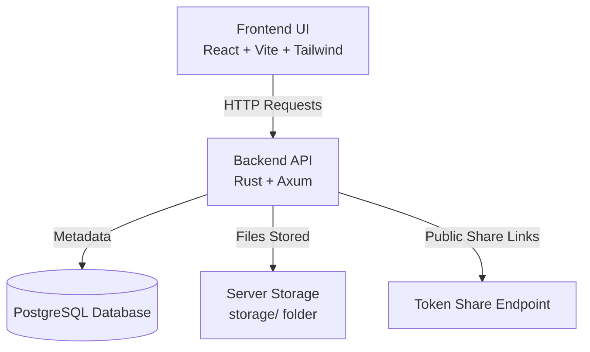

# PeakDrive 🚀


**PeakDrive** is a private team drive system built with a **Rust (Axum)** backend and **React (Vite)** frontend.

It is designed for internal organizations where accounts are created only by administrators (no public registration).

- Files are stored directly on server-side storage  
- Metadata and permissions are managed in **PostgreSQL**

---

## ✨ Features

- Admin-only user creation (no open signup)
- Secure authentication with JWT
- Folder and file management system
- Upload, download, and preview support
- Public share links via token
- Built-in Health Check diagnostics
- Clean separation between backend API and frontend UI

---

## 🏗 Architecture Overview


```mermaid
flowchart TD

    UI[Frontend UI<br/>React + Vite + Tailwind] -->|HTTP Requests| API[Backend API<br/>Rust + Axum]

    API -->|Metadata| DB[(PostgreSQL Database)]
    API -->|Files Stored| ST[Server Storage<br/>storage/ folder]

    API -->|Public Share Links| Share[Token Share Endpoint]
```

---

## 🛠 Tech Stack

### Backend
- Rust 1.98 (edition 2021)
- Axum 0.8 (Tokio runtime)
- SQLx 0.8 (PostgreSQL, runtime-checked queries)
- JWT Authentication (jsonwebtoken)
- russimp-ng (Assimp) + custom CPU rasteriser for 3D thumbnails
- ASP.NET Identity-compatible PBKDF2 password hashes (existing users keep working)

### Frontend
- React + Vite  
- Tailwind CSS  
- Axios  
- React Router  
- FontAwesome  
- React Three Fiber  

---

## 📂 Project Structure

```txt
peakdrive/
├── src/          # Backend (Rust + Axum)
├── migrations/   # SQLx database migrations
├── storage/      # Uploaded files + generated thumbnails
└── frontend/     # Frontend (React + Vite)
```

---

## ⚙️ Backend Setup

### Configuration Sources

PeakDrive reads configuration from environment variables, loaded from a `.env`
file at the repository root at startup.

Main config file:

```
.env
```

---

### Required Config Keys

| Key | Description |
|-----|------------|
| `Jwt__Key` | Secret key for token signing |
| `Jwt__Issuer` | Token issuer name |
| `Jwt__Audience` | Token audience |
| `ConnectionStrings__Default` | PostgreSQL connection string |
| `Storage__RootPath` | Root folder for file storage |
| `Share__BaseUrl` | Base URL for public share links |

The connection string may be either a `postgres://` URL or the Npgsql
`Host=..;Database=..;Username=..;Password=..` form (converted automatically).

---

### Environment Variable Example (Production)

```env
Jwt__Key=SUPER_SECRET_KEY
Jwt__Issuer=PeakDrive
Jwt__Audience=PeakDriveUsers

ConnectionStrings__Default=Host=...;Database=...;Username=...;Password=...

Storage__RootPath=storage
Share__BaseUrl=https://your-domain.com

Seed__MasterEmail=root@767
Seed__MasterPassword=765
```

ℹ️ Double underscore (`__`) separates nested sections (kept for parity with the
original ASP.NET Core configuration).

---

### Master Admin Seeding (Optional)

If database is empty, PeakDrive can auto-create a Master Admin account:

```env
Seed__MasterEmail=admin@peakdrive.local
Seed__MasterPassword=strongpassword
```

If not provided, seeding is skipped automatically.

---

### Run Backend

```bash
# from the repository root
# (Windows: run inside a VS Developer shell / after calling vcvars64.bat)
cargo run
```

Migrations are applied automatically on startup. Backend runs at:

```
http://localhost:5133
```

---

## 🎨 Frontend Setup

### Install & Run

```bash
cd frontend

npm install
npm run dev
```

Frontend runs at:

```
http://localhost:5173
```

---

### Dev Proxy Routing

During development:

- `/api`
- `/s`
- `/storage`

→ forwarded to backend:

```
http://localhost:5133
```

---

## 🔑 Main API Endpoints

### Authentication
- `POST /api/auth/login`

### Admin Management
- `POST /api/admin/create-user`
- `POST /api/admin/create-admin`
- `GET  /api/admin/list-users`
- `GET  /api/admin/activity-logs?take=N`
- `POST /api/admin/reset-password`
- `DELETE /api/admin/delete-user/{id}`

### Folder Management
- `POST /api/folders`
- `GET  /api/folders/{publicId}`
- `PUT  /api/folders/{publicId}`
- `DELETE /api/folders/{publicId}`
- `GET  /api/folders/download-zip/{publicId}`

### File Management
- `POST /api/files/upload?folderPublicId=X`
- `GET  /api/files/thumbnail/{publicId}`
- `GET  /api/files/view/{publicId}`
- `GET  /api/files/download/{publicId}`
- `GET  /api/files/usage`
- `PUT  /api/files/{publicId}`
- `DELETE /api/files/{publicId}`

### Trash
- `GET  /api/trash`
- `POST /api/trash/restore/file/{publicId}`
- `POST /api/trash/restore/folder/{publicId}`
- `DELETE /api/trash/clean`

### File Sharing
- `POST /api/share/{publicId}`
- `POST /api/share/folder/{publicId}`
- `GET  /s/{token}`

---

## ✅ Health Check Module

PeakDrive provides built-in diagnostics:

- `GET /health` (lightweight)
- `GET /health/full` (API + DB + Storage)

Example:

```bash
curl -i http://localhost:5133/health/full
```

---

## 📦 Build Frontend (Production)

```bash
cd frontend
npm run build
```

Output:

```
frontend/dist/
```

---

## 🚀 Deployment Overview

Recommended production routing (Nginx):

- `/api` → backend service
- `/storage` → backend static serving
- `/` → React frontend build

---

## 📜 License

This project is licensed under the **MIT License**  
Maintained by **DitDev**

See `LICENSE` for details.
